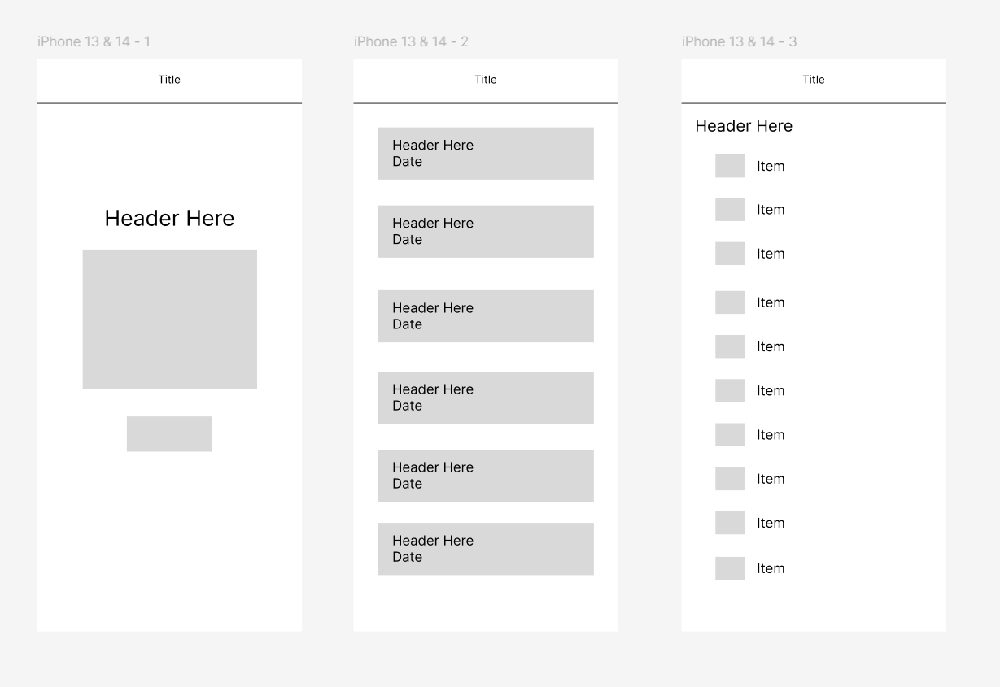

# RoamReady

RoamReady is a React Native Expo app designed to help users plan and pack for trips easily. It features dynamic packing lists per trip, custom fonts, vector icons, and responsive screen orientation handling.

---

## Features

- Trip list and individual packing lists with checkboxes
- Custom fonts using `@expo-google-fonts/roboto`
- Vector icons from `@expo/vector-icons` in headers and UI
- Screen orientation detection and responsive UI with `expo-screen-orientation`
- Navigation handled by `expo-router`
- Smooth user experience with React Native Paper components

---

## Screens

- **Home** — Welcome screen with app branding and navigation button
- **Trips** — List of trips with links to packing lists
- **Packing List** — Display packing items with interactive checkboxes

---

## WireFrame

---
